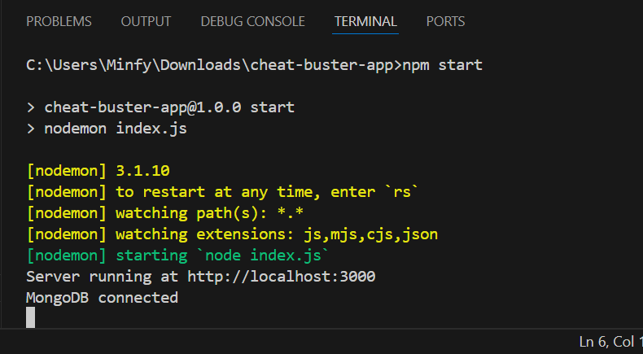

# Cheat Buster App

# Part 1(Backend Test):

## 1. Server Test:

### Outputs

## 2. Postman 1st Verification:

### Outputs

## 3. Existing Email verification:

### Outputs

## 4. MongoDB Atlas DB:

### Outputs

## 5. Seeding user:

### Outputs:

## 6. Invalid Email Test:

### Outputs

## 7. List all users:

### Outputs

- There are total 502 lines in JSON file. So, I am attaching one image

## 8. Pagination:

### Outputs

## 9. Search user by id:

### Outputs

## 10. Creating new users:

### Outputs

## 11. Updating profile:

### Outputs

## 12. Deleting profile:

### Outputs

---

# Part 2(Frontend Test):

## 1. Webpage:

### Outputs

## 2. User available in Database:

### Outputs

## 3. User not available in Database:

### Outputs

## 4. Zod Verification:

### Outputs
