# Secret Message Assignment

## 1. Setup:

### Outputs
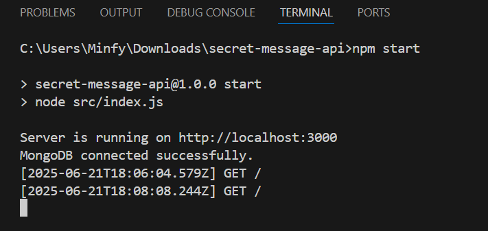
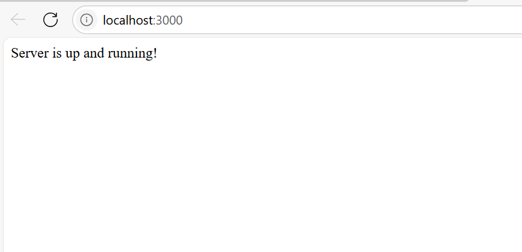

## 2. Create new message:

### Outputs
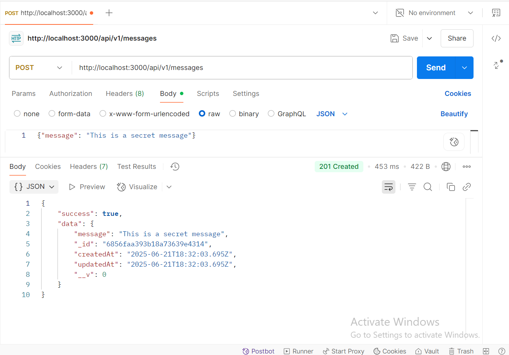
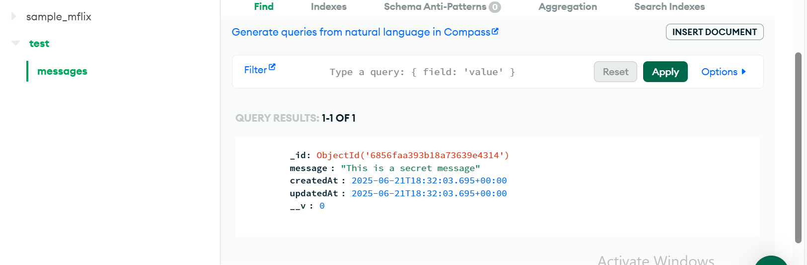

## 3. Invalid message(Zod Verification):

### Outputs
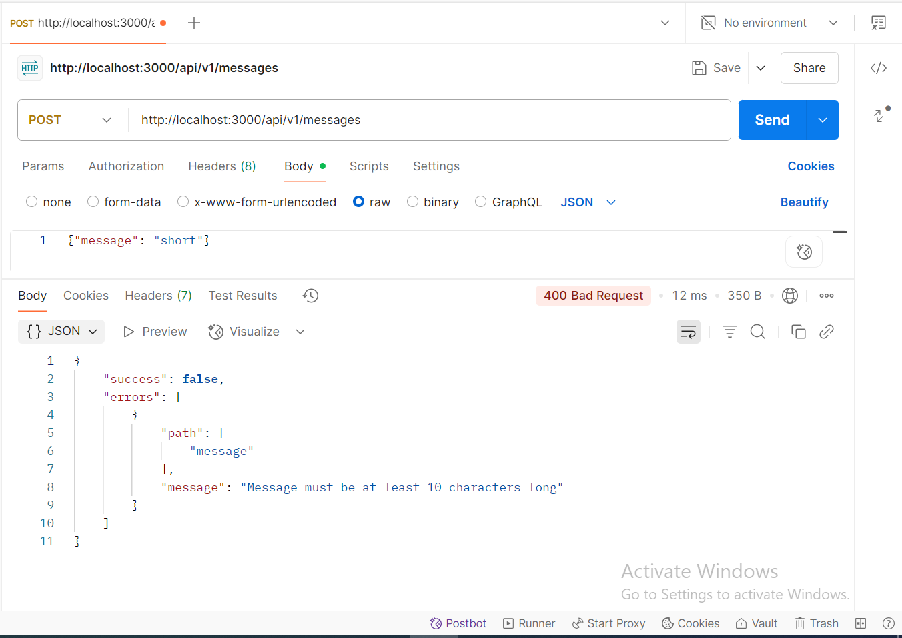

## 4. Get all messages:

### Outputs
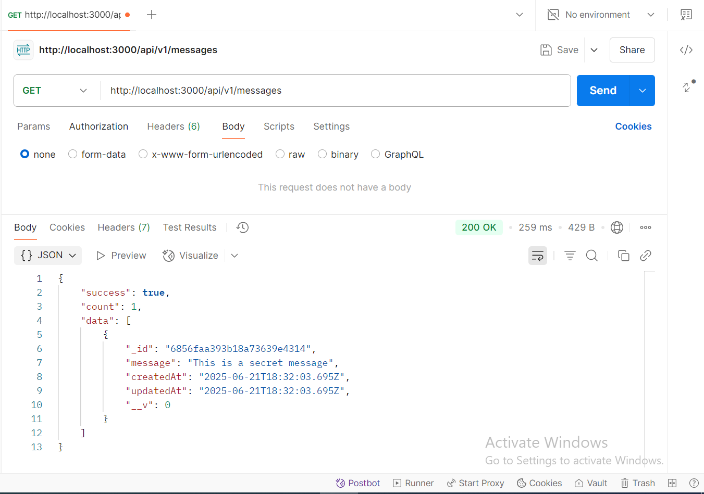

## 5. Get one message:

### Outputs
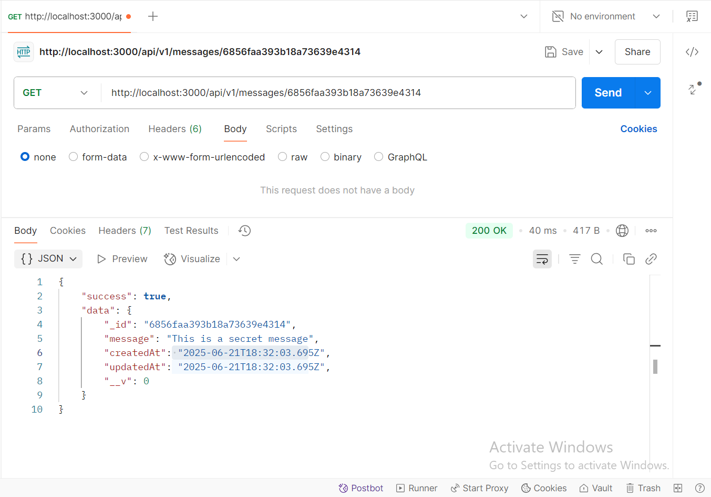

## 6. Get invalid message:

### Outputs
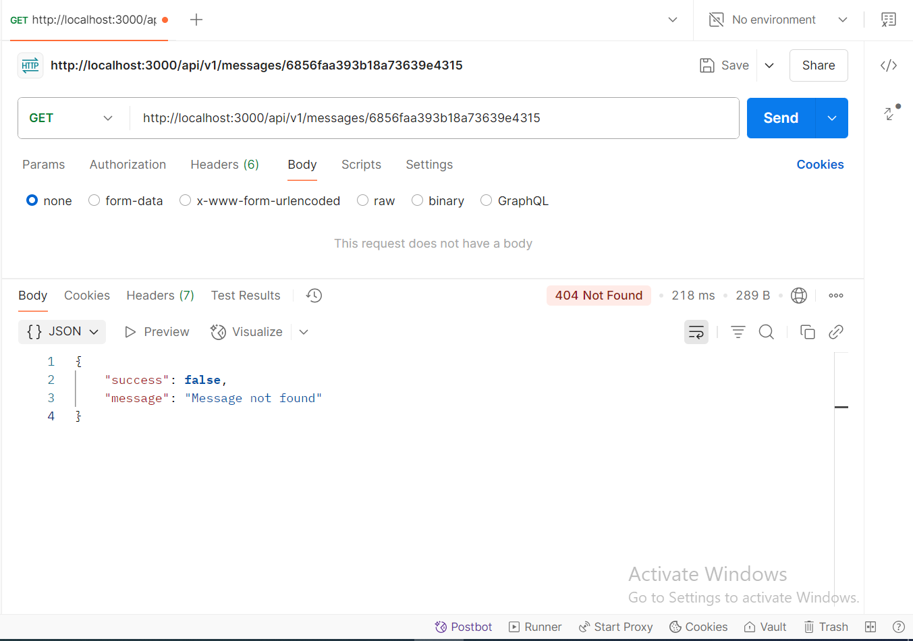

## 7. Delete message:

### Outputs
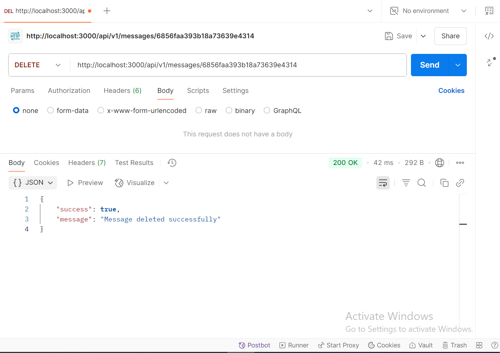
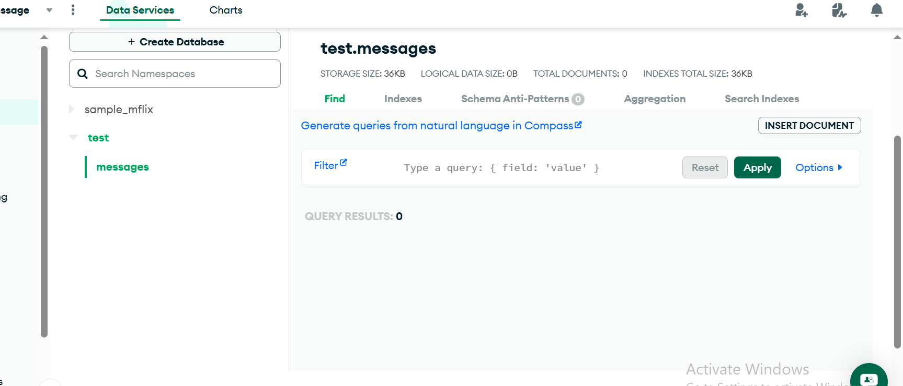

## 8. Logging Middleware:

### Outputs
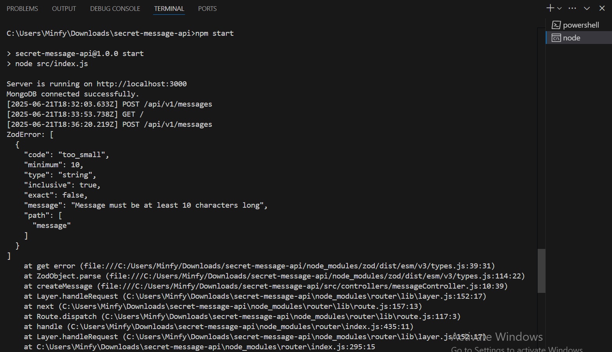
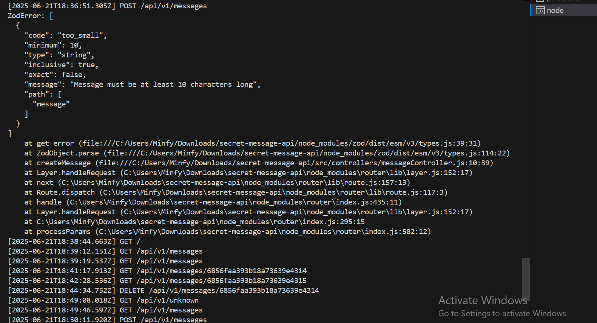