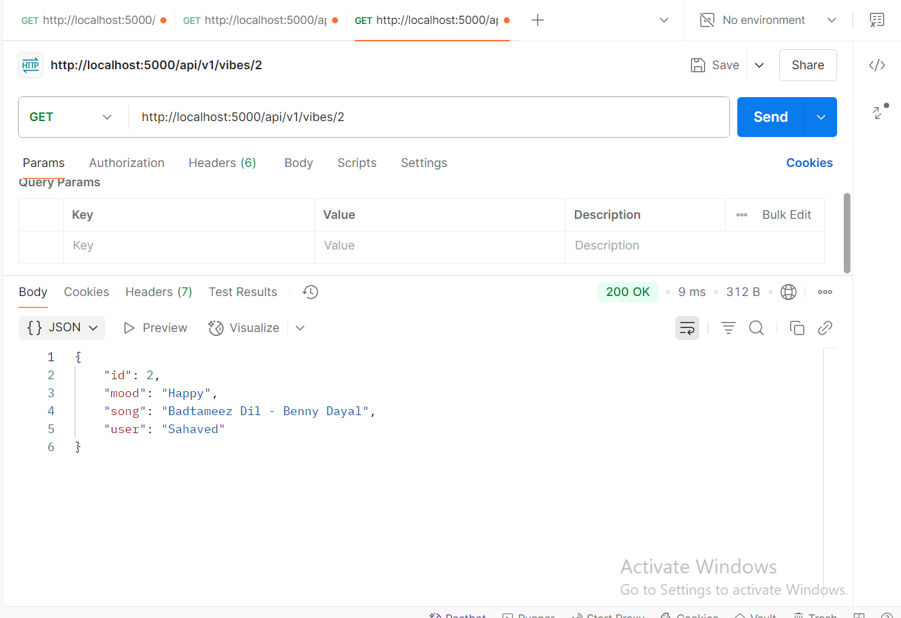
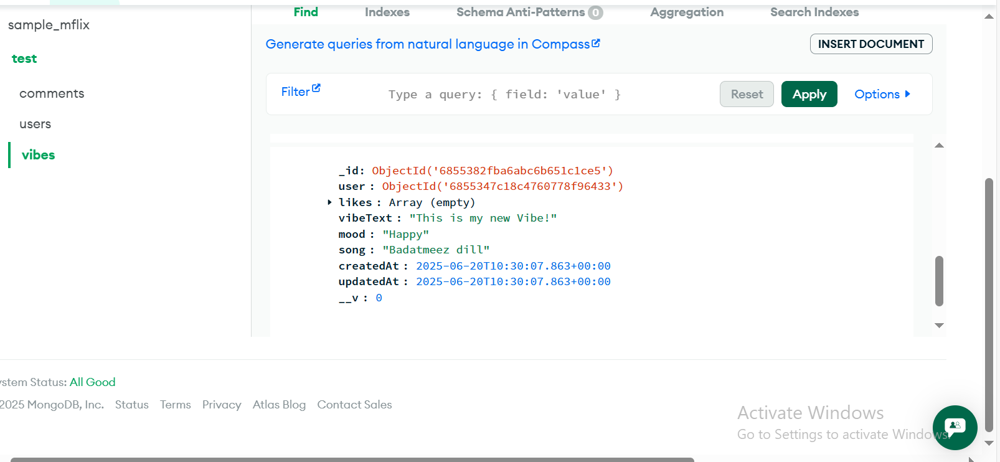

# Take home assignment

## Assignment 1: The Public Feed (Easy)

### Outputs

#### 1. Project Structure:

#### 2. Server is Running:

#### 3. Root Endpoint:

#### 4. Get All Vibes Endpoint:

#### 5. Get Single Vibe Endpoint (Success Case):

#### 6. Get Single Vibe Endpoint (Failure Case):

---

## Assignment 2: The User Era (Medium)

### Outputs

#### 1. New Project Structure:

#### 2. Database Connection:

#### 3. User Signup:

#### 4. User Login:

#### 5. Protected Route - Posting a Vibe:

#### 6. Populated Get All Vibes Endpoint:

---

## Assignment 3: The Social Experience (Hard)

### Outputs

#### 1. New Project Structure:
- Created new structure

#### 2. Like/Unlike Functionality:

#### 3. Comments Functionality:

#### 4. Follow & Personalized Feed:

#### 5. Authorization (Security Check):

#### 6. Global Error Handler & Logging:

#### 7. Pagination:

